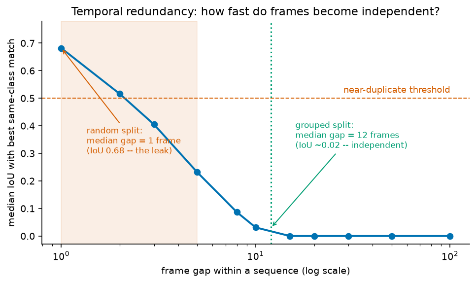

# Indoor Object Detection — YOLO11s

Detects seven indoor object classes — `chair`, `clock`, `exit`, `fireextinguisher`,
`printer`, `screen`, `trashbin` — in the TUT Indoor Object Detection Dataset
(2,213 annotated frames, 4,594 boxes, 1280×720).

Built with Python 3.11 and PyTorch 2.6. Training runs on Google Colab; the
repository also runs end to end on a local GPU.

---

## Results

Full per-class and whole-set metrics: [`reports/results.md`](reports/results.md)
(regenerated by `train.py` on every run). Raw numbers in
[`reports/metrics.json`](reports/metrics.json).

Metrics are computed with `pycocotools` against COCO-format ground truth, at
confidence 0.001 so the precision–recall curve is not truncated — not read out
of the training framework's own validation loop.

> **Note on rare classes.** `printer` and `screen` have 43 and 68 training boxes
> respectively. Their per-class AP is reported, but is estimated from ~15–19
> validation instances and is correspondingly noisy. The whole-set mAP is the
> more stable number.

---

## Setup

```bash
# 1. Environment (Python 3.11+ required)
conda create -n docusketch python=3.11 -y
conda activate docusketch

# 2. PyTorch — pick the build matching your CUDA runtime.
#    See https://pytorch.org/get-started/locally/ for other CUDA versions.
pip install torch torchvision --index-url https://download.pytorch.org/whl/cu124

# 3. Everything else
pip install -r requirements.txt
```

Place the dataset so that `Indoor Object Detection Dataset/annotation/` is
reachable from the repository root, or at `data/raw/Indoor Object Detection Dataset/`.
Both locations are detected automatically.

---

## Running it

```bash
# 1. Parse annotations, run the analysis, build the splits.
python prepare_data.py

# 2. Train and evaluate. Writes weights/best.pt, reports/results.md,
#    and the qualitative figures.
python train.py --config configs/default.yaml --dataset grouped --device 0

# 3. Verify the built dataset satisfies every invariant (optional, fast).
python scripts/run_checks.py

# 4. Inference on a directory of images.
python3 inference.py --input path/to/test_images --output path/to/predictions
```

`inference.py` writes, into `--output`:

| file | contents |
|---|---|
| `predictions.json` | every detection in COCO format — one flat, machine-scoreable list |
| `<image>.json` | per-image detections with pixel boxes and class names |
| `<image>.jpg` | the image with boxes drawn (skip with `--no-images`) |

Useful flags: `--weights`, `--conf` (default 0.25), `--imgsz` (match training),
`--device`, `--recursive`.

To reproduce the smoke test on a small GPU:
`python train.py --config configs/smoke.yaml --device 0 --eval-imgsz 416`.

---

## Project structure

```
├── prepare_data.py            # XML → analysis → splits → YOLO + COCO datasets
├── train.py                   # training + independent COCO evaluation + figures
├── inference.py               # the required CLI
├── configs/
│   ├── default.yaml           # full training run; every value carries its rationale
│   └── smoke.yaml             # 2-epoch local pipeline check
├── src/indoor_det/
│   ├── config.py              # class list, paths
│   ├── parse.py               # dlib XML → validated records (stdlib only)
│   ├── analyze.py             # EDA: the evidence behind each decision
│   ├── split.py               # leak-free grouped split + naive baseline
│   ├── build_dataset.py       # YOLO labels + COCO ground truth
│   ├── predict.py             # shared inference path
│   ├── evaluate.py            # pycocotools per-class + overall mAP
│   └── visualize.py           # automatic good/bad example selection
├── scripts/
│   ├── make_notebook.py       # generates the Colab notebook
│   ├── run_checks.py          # asserts the dataset invariants (16 checks)
│   └── package_submission.py  # builds submission.zip
├── notebooks/colab_train_eval.ipynb
├── reports/                   # metrics, figures
└── weights/best.pt
```

---

## Design choices

### The dataset is video, not photographs — and that decides everything

The six `sequence_*` folders are frames extracted from six continuous
walk-throughs. This is the single most consequential property of the data, and
it is not visible from the file listing.

Measuring it directly: for each annotated box, the IoU with its best same-class
match *n* frames later.

| frame gap | 1 | 2 | 3 | 5 | 8 | 10 | 15+ |
|---|---|---|---|---|---|---|---|
| median IoU | **0.68** | 0.52 | 0.40 | 0.23 | 0.09 | 0.03 | 0.00 |



Consecutive frames are the same picture. A uniformly random 80/10/10 split
leaves a **median gap of 1 frame** between each validation image and its nearest
training image — the model is scored on views it has already memorised. The
reported mAP would be inflated and would not survive the hidden test set that
this submission is actually graded on.

**The split used here** cuts each sequence into contiguous 40-frame blocks and
assigns whole blocks, so near-duplicates never straddle a boundary. Median gap
to the nearest training frame rises to **12 frames**, where median IoU has
already fallen to ~0.03 — effectively independent views.

A per-*sequence* split would be even cleaner, but is impossible here: `printer`
occurs almost only in sequences 2 and 3, so whole-sequence holdout cannot put
all seven classes in all three splits as the brief requires.

Blocks are allocated by greedy multi-label stratification (rarest class first,
weighted 1/√frequency), then rebalanced toward 80/10/10 under a constraint that
no split may lose its last instance of a class. `select_split()` searches block
sizes {20, 25, 30, 40} × 20 seeds and picks the best split under an explicit
objective — all classes present, median gap ≥ 10, ratios within 2 points —
maximising the worst-case per-class count in val/test. 29 of 80 candidates were
feasible.

**Resulting split** (all seven classes present in all three, as required):

| split | images | frac | chair | clock | exit | fireext | printer | screen | trashbin |
|---|---:|---:|---:|---:|---:|---:|---:|---:|---:|
| train | 1784 | 80.6% | 1382 | 235 | 452 | 1302 | 43 | 68 | 200 |
| val | 200 | 9.0% | 188 | 20 | 57 | 207 | 19 | 15 | 16 |
| test | 229 | 10.3% | 91 | 25 | 36 | 175 | 19 | 32 | 12 |

The naive random split is still built (`data/processed/random/`) purely so the
inflation can be *measured* rather than asserted — see the ablation section of
the notebook.

### Model: YOLO11s

| candidate | verdict |
|---|---|
| **YOLO11s** | **Chosen.** Best accuracy-per-epoch in this regime, COCO-pretrained, and its mosaic augmentation directly addresses the rare-class problem. |
| YOLO11n | Underfits a 7-class problem that hinges on texture and context. |
| YOLO11m/l | 1,784 frames from six rooms cannot support the capacity; it would memorise rooms. |
| Faster R-CNN / RetinaNet (torchvision) | Fewer dependencies and a fully explicit loop, but slower to train and typically a few mAP behind a modern one-stage detector. |
| DETR | Needs far more data and far longer schedules to converge; 1.8k images is well below its useful range. |

COCO pretraining is unusually well matched here: COCO already contains `chair`,
`clock` and `tv` (≈ `screen`), so Ultralytics' name-based head remapping copies
those output weights directly rather than starting from random.

### Input resolution: 960

Frames are 1280×720. Objects are large — median √area 151 px, and only 10 of
4,594 boxes are COCO-"small" — so extreme resolution is unnecessary. But at the
usual 640 the effective scale is 0.5×, which pushes the smallest 5% of boxes
(~55 px) down to ~27 px. 960 keeps them near 41 px. With only 1,784 training
images the extra compute is affordable.

### Augmentation

Chosen from what the scenes physically permit, not from a default list:

- **`mosaic: 1.0`, disabled for the last 15 epochs.** The highest-value
  augmentation here: composing four frames multiplies effective exposure to
  rare classes and creates scale/context combinations the six sequences never
  contain. Turning it off at the end lets the model finish on the real image
  distribution it is evaluated on, closing the train/test domain gap.
- **`fliplr: 0.5`.** Indoor scenes are near mirror-symmetric.
- **`flipud: 0.0` — deliberately off.** These scenes are gravity-aligned. An
  upside-down exit sign or fire extinguisher cannot occur at inference time;
  training on one spends capacity on an impossible input.
- **`hsv_s: 0.7`, `hsv_v: 0.4`.** Lighting varies strongly across sequences
  (fluorescent strips, daylight through windows, dim corridors). Hue barely
  varies indoors, so `hsv_h` stays small.
- **`scale: 0.5`, `degrees: 5.0`, `translate: 0.1`.** Matches a hand-held camera
  walking toward and past objects.
- **`mixup: 0.0`, `perspective: 0.0`.** Blended images give ambiguous box
  targets; perspective warps distort the rectilinear structure (door frames,
  signage) that gives several of these classes their shape prior.

### Optimisation

AdamW, `lr0=1e-3`, cosine decay, 3 warm-up epochs, 150 epochs with
`patience=30`. At ~110 iterations per epoch with a pretrained backbone, AdamW's
per-parameter scaling converges in far fewer epochs than SGD+momentum, which
would need careful LR tuning to match. Warm-up protects the pretrained weights
from the randomly-initialised head's first gradients; cosine decay matters
because the final epochs run without mosaic.

### Loss

YOLO11's default composite, kept deliberately:

- **CIoU** for box regression — optimises overlap, centre distance and aspect
  ratio together, unlike a plain L1 on coordinates.
- **Distribution Focal Loss** — predicts a distribution over each box edge
  rather than a point estimate, which helps where boundaries are genuinely
  ambiguous (a chair occluded by a table).
- **BCE** for classification, assigned by a **TaskAlignedAssigner** that selects
  positives by a joint classification-and-localisation score, so confidence
  correlates with box quality. That alignment is most of why modern one-stage
  detectors score well at the strict end of mAP@[.5:.95].

These weights are tuned jointly with the architecture, and this dataset offers
no evidence that a different balance is better, so they are left alone.

### Evaluation

Scoring goes through `pycocotools` on COCO-format ground truth rather than the
trainer's internal validator, so that (a) the numbers are comparable to
published COCO results, (b) a second architecture could be dropped in and
scored identically, and (c) the metric is independent of any framework-specific
NMS or threshold choice made during training.

One detail that materially changes the result: evaluation runs at confidence
**0.001**, not 0.25. Average Precision integrates precision over the whole
recall range, so thresholding first would truncate the PR curve and understate
mAP. The 0.25 threshold is used only for human-facing output.

### Qualitative examples

Selected automatically, not by hand: every validation image is matched
prediction-to-ground-truth exactly as the metric does (greedy, highest
confidence first, IoU ≥ 0.5), ranked by per-image F1, and the best and worst six
rendered. Each failure is attributed to a cause — missed object, false positive,
wrong class, or loose box — so the report can say *why* the model loses points.

### Class imbalance

20.8:1 between `fireextinguisher` (1,684) and `printer` (81). Handled by mosaic
(raising effective rare-class exposure per batch) and by stratifying the split
so rare classes are not concentrated in one fold. Loss re-weighting and rare-class
oversampling were considered and left out: with 43 training instances of
`printer`, both mostly amplify the risk of memorising those specific frames.
The honest per-class AP is reported instead.

### Data cleaning

11 boxes extend past the frame edge (annotator dragged outside the canvas) and
are clipped rather than dropped — the visible part is still a valid object. One
1-pixel-wide box is discarded as annotation noise. The 6 object-free frames are
kept as genuine negatives, which suppress false positives; they are written as
empty `.txt` label files so the trainer treats them as background rather than
logging them as missing labels.

---

## Limitations and next steps

- **`printer` and `screen` remain data-limited.** The most effective next step is
  more data, not more model. Failing that, targeted copy-paste augmentation of
  those two classes.
- **Six rooms is narrow.** The model will transfer better to corridors resembling
  the source building than to arbitrary interiors. The grouped split makes the
  reported metric honest, but cannot manufacture diversity that isn't there.
- **Not tried, in priority order:** test-time augmentation; a
  YOLO11m run to confirm 's' is the right capacity; an ensemble; and a
  torchvision Faster R-CNN baseline for an architecture-level comparison.

---

## Colab

`notebooks/colab_train_eval.ipynb` runs the whole pipeline: clone → install →
fetch dataset → analyse → split → train → evaluate → visualise → ablation →
inference → package.

Select **GPU** under `Runtime → Change runtime type`. An **L4** (Colab Pro) is
the sweet spot — roughly 2× a T4 at moderate compute-unit cost. A free-tier
**T4** also completes the run, taking roughly twice as long, with the usual
risk of idle disconnects. An A100 is not worth the units for a dataset this
size.

The dataset (~400 MB) exceeds GitHub's 100 MB file limit, so attach it as a
**GitHub Release asset** and set `DATASET_URL` in the notebook. A Google Drive
mount is offered as a fallback.
