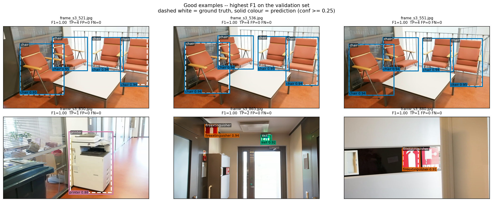
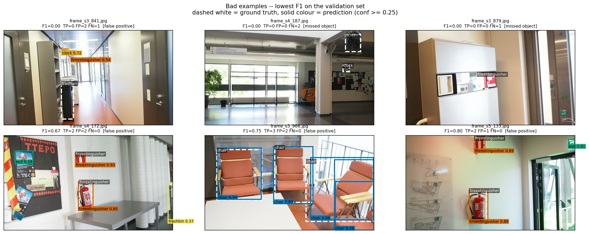

# Results

Model: `yolo11s.pt`  |  split: `grouped`  |  train imgsz: 960  |  epochs: 60

Metrics are computed with `pycocotools` against COCO-format ground truth,
at confidence threshold 0.001 so the precision-recall curve is complete.

## val (200 images, 522 objects)

| class | instances | AP@50 | AP@50-95 |
|---|---:|---:|---:|
| chair | 188 | 0.9992 | 0.9076 |
| clock | 20 | 0.9312 | 0.7491 |
| exit | 57 | 0.9980 | 0.7503 |
| fireextinguisher | 207 | 0.9967 | 0.7682 |
| printer | 19 | 0.9210 | 0.6495 |
| screen | 15 | 0.9093 | 0.6415 |
| trashbin | 16 | 0.8895 | 0.6500 |
| **all (macro)** | **522** | **0.9493** | **0.7309** |

Whole-set mAP@50-95 **0.7309**, mAP@50 **0.9493**, mAP@75 0.8377. By object size -- medium 0.6565, large 0.7801.

## test (229 images, 390 objects)

| class | instances | AP@50 | AP@50-95 |
|---|---:|---:|---:|
| chair | 91 | 0.9108 | 0.6507 |
| clock | 25 | 1.0000 | 0.8075 |
| exit | 36 | 1.0000 | 0.8471 |
| fireextinguisher | 175 | 0.9957 | 0.8179 |
| printer | 19 | 0.6592 | 0.4681 |
| screen | 32 | 0.6017 | 0.4504 |
| trashbin | 12 | 0.8775 | 0.5924 |
| **all (macro)** | **390** | **0.8636** | **0.6620** |

Whole-set mAP@50-95 **0.6620**, mAP@50 **0.8636**, mAP@75 0.7785. By object size -- medium 0.6218, large 0.6780.

## Qualitative analysis

Scored at confidence >= 0.25; mean per-image F1 0.922.

| error type | count |
|---|---:|
| missed object (FN) | 18 |
| false positive (FP) | 38 |
|   of which wrong class | 0 |
|   of which loose box | 1 |
| true positive (TP) | 504 |

